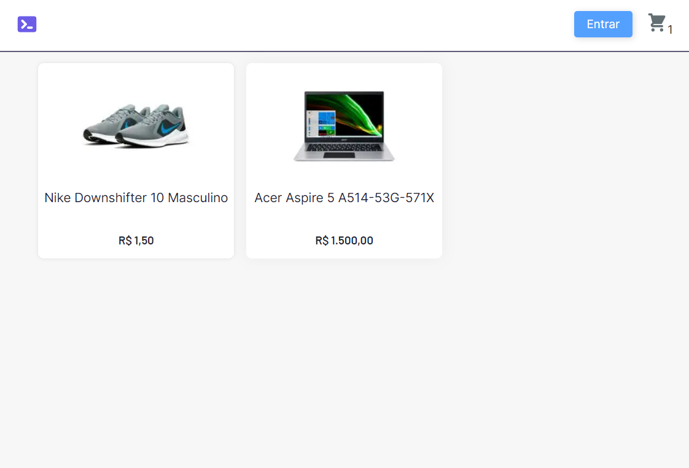
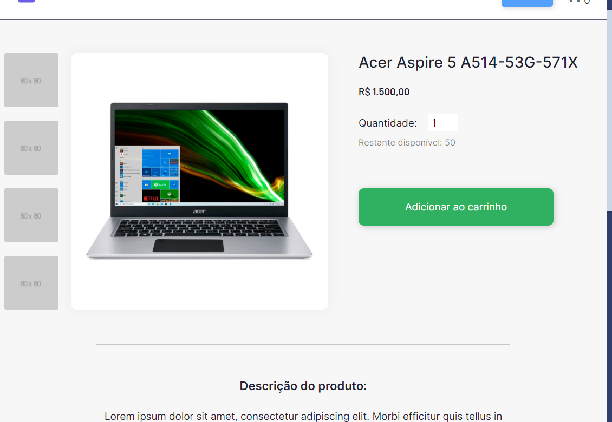
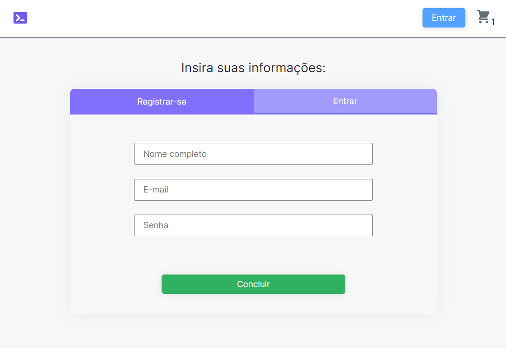
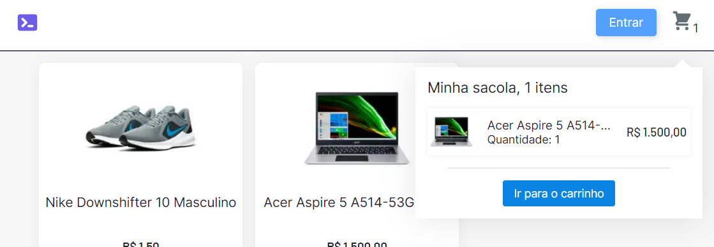
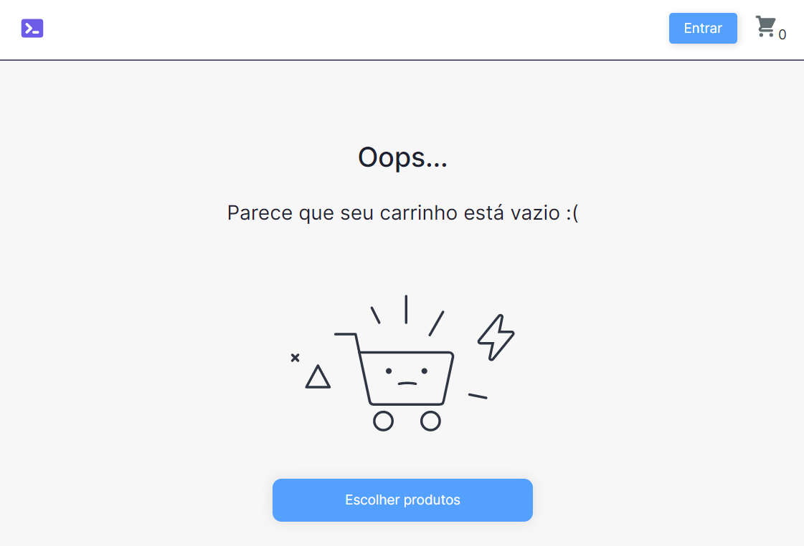

# Ecommerce com Next.js e Strapi CMS 💻 [Cloud ☁️] 

Este é um projeto desenvolvido para testar o CMS do Strapi e integrações com o Stripe (meio de pagamento/checkout);

Inicialmente foi construído com host local de imagens e informações (SQLite) e posteriormente migrado para o Cloudinary (hospedagem de imagens) e MongoDB Atlas para tornar a aplicação Cloud;

Ainda não foi hospedado em nenhuma plataforma para poder funcionar em produção, pois está em fase de construção e testes, a idéia era construir algo viável para poder distribuir para possíveis clientes, porém, não tenho muito tempo para aprimorar o projeto e dar suporte.

## Funcionalidades

O sistema back-end consiste de uma aplicação admin (Strapi CMS) onde é cadastrado produtos e suas categorias, bem como feito o upload de imagens para estes produtos e também, gerenciamento de usuários na aplicação.
Esta aplicação admin irá controlar também os pedidos feitos (ainda não implementado).

Já o front-end está construído em Next.js, onde tem a tela inicial, demonstrando os produtos cadastrados no Strapi, uma tela de detalhes de um produto, o checkout, autenticação e pagamento gerenciado pelo Stripe.  

Também com direito a "carrinho salvo" por meio de LocalStorage (quantidade de itens, produtos selecionados e valor total) e autenticação JWT armazenada no LocalStorage também para permanecer logado no mesmo navegador.

Segue algumas screenshots das funcionalidades:

### Tela inicial:

### Detalhes do produto:

### Autenticação:

### Carrinho:

### Checkout:

### Carrinho vazio:

------

## Tecnologias usadas:

- HTML;
- CSS (CSS Modules inicialmente, e migrando para Styled Components);
- JavaScript, React e Context API;
- Next.js;
- RESTful API (Strapi);
- Stripe (meio de pagamento);
- MongoDB e SQLite;
